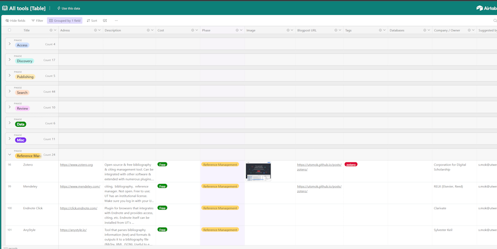
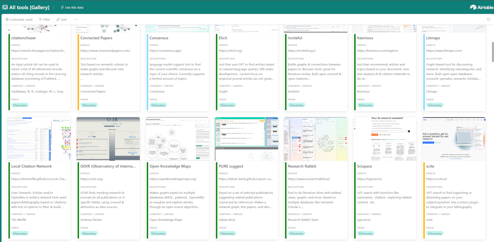

+++
title = "The List"
slug = "list"
date = "2023-05-18"
[taxonomies]
categories=["Tool list"]
tags=["list", "table", "links", "tools", "gallery"]
+++

**The List** is the main reason this site exists, and is made and continuously updated by [me](@/_index.md#the-author). It's a database filled with all kinds of systems and tools that are useful for doing research, but especially focused on searching & getting access to literature, storing & citing your sources, and doing literature reviews. Each entry in the database contains at least a link and a description, and where possible a lot more data is added, like the owner of the tool, if it's free or not, which underlying academic databases are used, etc. The database is hosted on [airtable.com](https://airtable.com), which enables me to link multiple datasets and build custom views.

# Links to database views

## Table
[Full Table](https://airtable.com/shrR9noEMoxsdHTzv)

Use this link if you want to open the full table to browse, filter, search, or copy for your own use. The data has been grouped in categories by default, but you can use the buttons on top to change it to the way you'd like. 

## Gallery

[Gallery View](https://airtable.com/shrifnLw2VGslFH54)

If you prefer to browse the database as a gallery of items instead of a table you can use this view. The data is the same as in the full table, any fields not directly visible on a card can be viewed by clicking an item.

## Subviews

There are some pre-configured dataviews available as well:

[List of Zotero plugins](https://airtable.com/appRsRvhBmDNX8qD5/shrqtcH7g481zAA46)
[List of databases with academic publications](https://airtable.com/appRsRvhBmDNX8qD5/shr6OJtLyEV0qQHjk)

# Want a copy of the data?

From airtable you are able to copy and re-use the data as you wish, just be sure to link back to the source and mention me as the author for any non-personal usage. The dataset is also periodically backed up on my [Github](https://github.com/utsmok/informationtools) as flat CSV files. 

