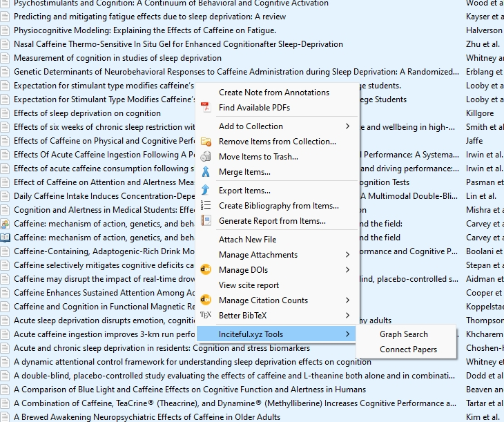
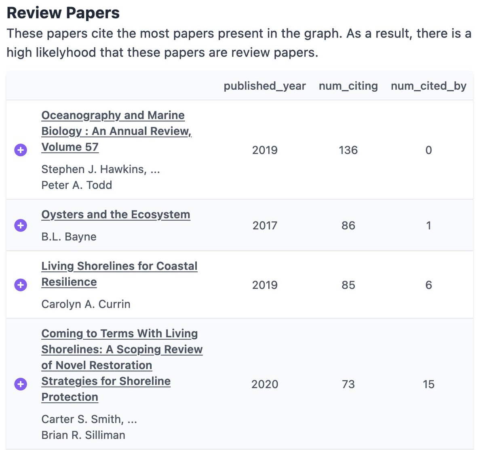
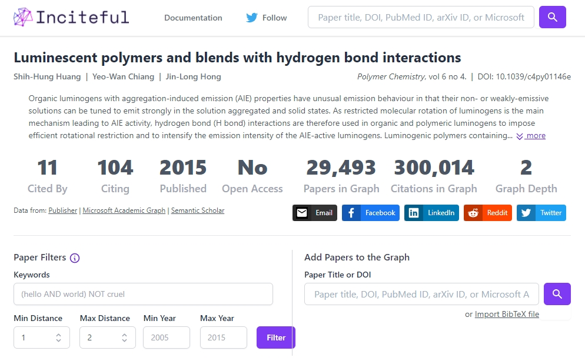
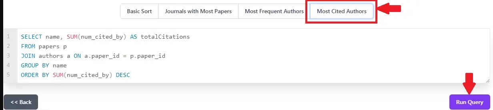

+++
title="inciteful.xyz: easily find more sources based on your current bibliography" 
date=2023-05-18
[taxonomies]
categories=["Search tools"]
tags=["citations", "guides", "tools"]
+++

Ah, what a wonderful time, you're starting a new research project! You received  a couple of papers from your supervisor to get you started, and you're certain there's quite some more relevant articles out there that will get you on the right track. You sit down and start working on a great boolean search query in Scopus. After a lot of iterations you've constructed a search expression that gives you some relevant results, but you have a feeling you're missing some crucial papers. Oh well. After a quick scan you grab the first 20 useful-looking papers from the long list of results, and quickly move on before you completely burn out.

Sounds familiar? Well, luckily there are a lot of tools that will make this process faster, easier, more fun, *and* produce more relevant results to boot! Let's dive into my favorite example: [inciteful.xyz](https://inciteful.xyz/).

<!-- more -->
# inciteful.xyz

> [inciteful.xyz](https://inciteful.xyz/) 
> 
> Recommends articles based on a large citation graph using simple but powerful queries
> 
> Free & open source
> 
> Uses data from [OpenAlex](https://openalex.org/)

[inciteful.xyz](https://inciteful.xyz/) is a wonderful tool that uses a list of papers that you provide to produce a lot of recommendations in clear, concise tables. It's completely free and open source, and also uses completely free and open databases to source its information. 
inciteful has been around for a while. Initally using Microsoft Academic graph, moving on to Semantic Scholar's database afterwards, and recently (february 2023) improved things by switching to using OpenAlex as the main source for papers.

So, how does it work? You start by supplying it with one or multiple papers, books, or any other item indexed by OpenAlex. You can do this either by entering a DOI, paper title, pubmed URL, or arXiv URL; or by importing a BibTeX file containg your sources. If you use Zotero (highly recommended!) you can also [install the inciteful zotero plugin](https://github.com/inciteful-xyz/inciteful-zotero-plugin) that lets you add papers directly from Zotero, which makes things even easier.

Once you've entered your papers, the tool will look up all citations of the papers, both forwards (papers that cite the input papers) and backwards (papers that have been cited by the input papers). Then it will do a second round, grabbing the forwards and backwards citations of *all the papers it found in the first round*. You can imagine this will produce a gigantic list of papers. inciteful doesn't just give this in a list: it produces a graph with the most important papers, including how they are related. In my experience: not -that- useful, and there are better tools to make graphs like that. 

The main draw are the lists it generates, each sorted by a different algorithm or parameter. There's a list with similar papers (they cite the same papers that you used as input), seminal works (older papers with tons of citations), review papers (papers with lots of references), recent gems (new papers with relatively large amounts of citations), and more. See an interesting paper? You can add it to your list by pressing on the purple plus next to it. You can do this as many times as you want. Done? You can run the process again, now with the added papers taken into acount. You can of course also click on each found paper to get more information and a direct link to the page where it's published. 

Still not satisfied? It's even possible to edit the SQL queries that produce the results! Once you're done you can export all the papers you added in the format you like, the easiest option is to use Zotero (as is almost always the case).

*Want to see which tools can help you do research? Check out [the main list](@/list/_index.md) of information tools on this site.*
