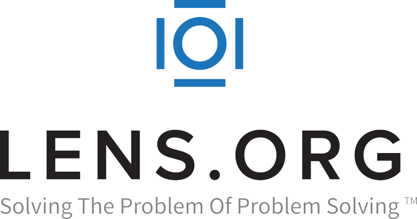

+++
title="A free scholarly search engine that blows competitors out of the water: lens.org" 
date=2023-06-17
[taxonomies]
categories=["Search tools"]
tags=["structured search", "guides", "tools"]
+++

When you're doing a structured literature search chances are you're using one of the main commercial scholarly search engines like [Scopus](www.scopus.com), ["Web of Science"](https://www.webofscience.com/), or if you don't care a lot about reproducability (or don't have access to other search tools), [Google Scholar](https://scholar.google.com/). And I musn't forget about [PubMed](https://pubmed.ncbi.nlm.nih.gov/) either, for those doing anything related to healthcare. 

None of them are perfect: for instance, Scopus & WoS cost quite some money to access in order to keep the profit margins of Elsevier & Clarivate nice and big, which limits their accessibility for those without instutional subscriptions.  Besides, their interfaces are not exactly the most intuitive or attractive to use, especially when you're new to this world. 

Luckily the last few years a lot of good free alternatives have been popping up. Not only open databases containing scholarly works, like [OpenAlex](https://openalex.org/) or [Crossref](https://www.crossref.org/) for instance, but also complete structured search engines, like the large language model based [Semantic Scholar](www.semanticscholar.com), or the one we're talking about in this post today: [The Lens](www.lens.org).

<!-- more -->
# The Lens

> [lens.org](https://lens.org/) 
> 
> A structured search engine for scholarly works built on top of open databases
>
> Modern interface with advanced search options, citation tracking, custom display of results and analysis, and more
> 
> Also has one of the largest patent databases, which is highly interlinked with scholarly publications
>
> Free to use, run by a non-profit organisation
> 
> Uses data from [OpenAlex](https://openalex.org/), [Microsoft Academic](https://www.microsoft.com/en-us/research/project/academic/), [PubMed](https://pubmed.ncbi.nlm.nih.gov/), [Crossref](https://www.crossref.org/)
